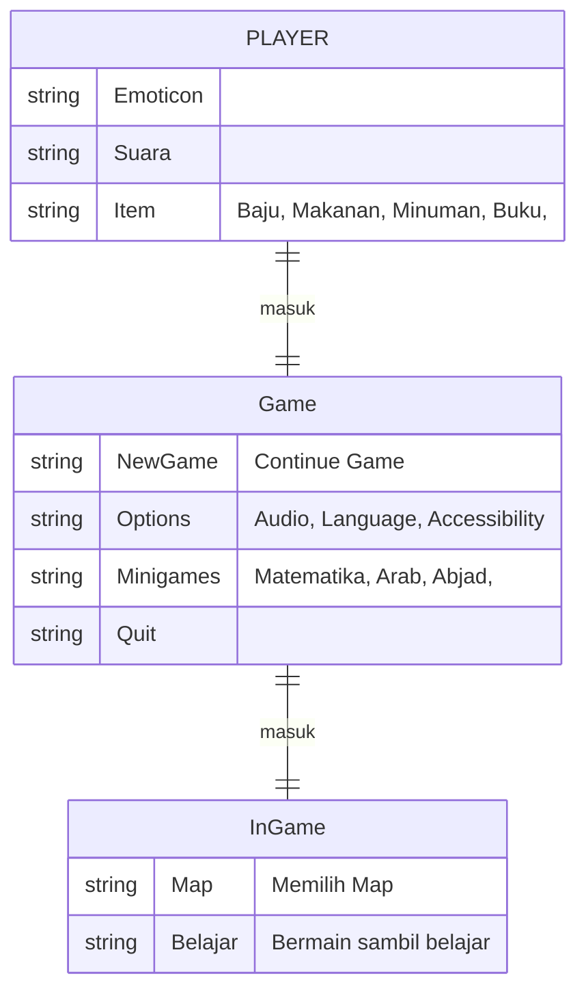
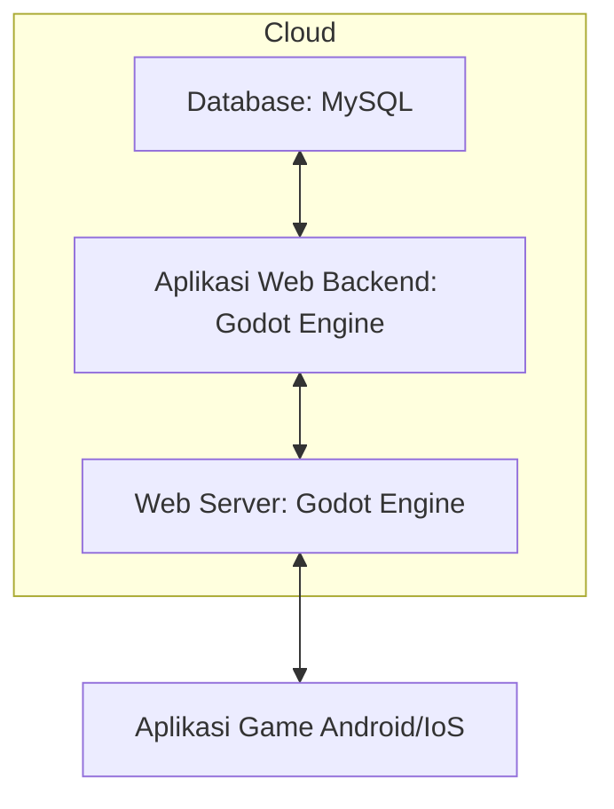

## 1.1 Latar Belakang

Dalam era digital seperti sekarang ini, bayak kalangan anak kecil yang sering bermain smartphone dan kemungkinan banyak anak di bawah umur malah melihat konten atau game - game yang seharusnya untuk kalangan remaja, makadari itu sebenernya kurang mendidik. Menurut laman eraspace.com menjelaskan bahwa dampak negatif bermain game yang peruntukan nya untuk orang dewasa yaitu menjadikan anak menjadi agresif dan mengingat kembali game dengan rating dewasa biasanya mengandung konten kekerasan maupun aktivitas yang baru bisa dicerna saat dewasa, hal ini akan berdampak buruk pada pola pikir anak di kehidupan nyata yang memang seharusnya belum boleh dikonsumsi. Bisanya anak-anak akan melakukan adegan kekerasan yang serupa di kehidupan nyata karena biasa terjadi dalam game tersebut. Disisni saya akan membuat sebuah game edukasi yang bisa di jangkau oleh anak di bawah umur.

## 1.2. Deksripsi Teknologi Informasi

Aplikasi game ini adalah solusi bagi anak di bawah umur yang ingin belajar melalui aplikasi game ini, di dalam game ini terdapat beberapa materi yang mudah di pahami untuk kalangan di bawah umur, untuk game ini di buat menggunakan Godot Engine dengan bahasa GDScript game juga mempunyai beberaoa core seperti game suvival (bisa berjalan, melakukan interaksi) disini saya menawarkan aplikasi ini yang di dalam nya terdapat :
- hurup - hurup abjad
- huruf hijaiyah
- perhitungan dasar

  Dalam game ini juga penggukan dapat menjelajah untuk bisa memasuki pembelajaran sepeti di dapem ada masjid nah kita dapat belajr hurup hijaiyah dan bisa megisi pertanyaan dasar di dalam game tersebut, selanjutnya saya juga akan memasukan gedung atau kelas pembelajaran seperti pertambahan pengurangan dan di sni pun bisa bermain game sambil belajar game ini  terinspirasi oleh game yaitu Baby Bus, Harvest Moon, Aplikasi Belajar TK dan PAUD (yang di buat oleh solid kids). Itulah game yang meng inspirasi karena dari game game tersebut saya komplikasi kan jadi game ini bisa di sebut open map yang bisa menjelajah untuk memasuki kelas kelas yang di sediakan.

## 1.3. Branding

Nama Produk: Magic Adventure
Logo: Logo gambar animasi mencerminkan Semangat Belajar.
Slogan: "Jelajahi Dunia Pendidikan dengan Senyuman." 
Warna: Kombinasi warna warnni untuk memikat pengguna. 
Misi: Meminimalisir anak di bawah umur bermain game yang kurang mengedukasi.

- Target User : 
  - Usia 8+
  - penggemar game
  - orang yang ingin belajar
  - Untuk Keluarga

- User experience them :
  - Mudah dipahami
  - Beredukasi
  - Ramah untuk Keluarga
  - memudahkan beljar
             
Dengan Aplikasi Magic Adventure ini bisa untuk mengedukasi anak di bawah umur bahwa penting nya belajar.

Inspirasi Desain :

## 2. User Story

Sebagai | Saya ingin bisa | Sehingga | Prioritas
---|---|---|---
Pengguna | Memulai game | Dapat dimainkan | ⭐⭐⭐⭐
Pengguna | Memilih gane belajar | Dapat memilih pembelajaran yang diinginkan | ⭐⭐⭐⭐
Pengguna | Menjalankan karakter | Bisa menjelajah | ⭐⭐⭐⭐
Pengguna | Mendapat materi lebih menyenangkan | Dapat lebih santai saat belajar | ⭐⭐⭐⭐⭐
Pengguna | Menambah Edukasi | Lebih mudah di cari | ⭐⭐⭐⭐
Pengguna | Menambah wawasan | kita dapat mengenal lebih jauh tentang pendidikan | ⭐⭐⭐⭐
Pengguna | Mencari hurup abjad |endatangi gedung sekolah | ⭐⭐⭐⭐
Pengguna | Belajar Hurup hijaiyah | Mendatangi Masjid atau Masdrasah islam | ⭐⭐⭐⭐
Pengguna | Belajar matematika dasar | Pengguna bisa mendatangi Gedung yang bergambar angka | ⭐⭐⭐⭐

## 3. Struktur Data

## 4. Arsitektur Sistem

## 5. Teknologi, Library, dan Framework

Teknologi informas yang di gunakan hanya Godot, dari bahasa nya pun memakai godot dan tidak menggunakan yang lain , digodot juga tersedia semuanya dari codingan nya editing nya ada jadi baik nya menggunakan godot.

## 6. Desain User Experience dan User Interface

## Bahasa Pemrograman / teknologi 
Game Petualangan Ajaib ini menggunakan bahasa pemograman godot.

## Framework
Game Petualangan Ajaib dibangun dengan Godot, menggunakan bahasa yang ada pada Godot.

## Library
Menyediakan edukasi yang di pelajari di anak di bawah umur seperti alfabet, huruf hijaiyah, perhitungan dasar dan massih banyak lainnya.
