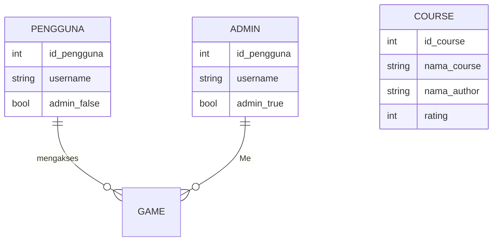

## 1.1 Latar Belakang

Dalam era digital seperti sekarang ini, bayak kalangan anak kecil yang sering bermain smartphone dan kemungkinan banyak anak di bawah umur malah melihat konten atau game - game yang seharusnya untuk kalangan remaja, makadari itu sebenernya kurang mendidik. Disisni saya akan membuat sebuah game edukasi yang bisa di jangkau oleh anak di bawah umur.

## 1.2. Deksripsi Teknologi Informasi

Aplikasi game ini adalah solusi bagi anak di bawah umur yang ingin belajar melalui aplikasi game ini, disini saya menawarkan aplikasi ini yang di dalam nya terdapat :
- hurup - hurup abjad
- huruf hijaiyah
- perhitungan dasar

## 1.3. Branding

Nama Produk: Petualangan Ajaib Logo: Logo gambar animasi mencerminkan Semangat Belajar. Ikonnya adalah Hewan yang sedang membaca buku dan menggunakan topi toga. Ini menggambarkan Bahwa belajar itu menyenangkan.

Slogan: "Jelajahi Dunia Pendidikan dengan Senyuman." Warna: Kombinasi warna warnni untuk memikat pengguna. Misi: Meminimalisir anak di bawah umur bermain game yang kurang mengedukasi.

Dengan Aplikasi Petualangan Ajaib ini bisa untuk mengedukasi anak di bawah umur bahwa penting nya belajar.

## 2. User Story

Sebagai | Saya ingin bisa | Sehingga | Prioritas
---|---|---|---
Pengguna | Mendapat materi lebih menyenangkan | Dapat lebih santai saat belajar | ⭐⭐⭐⭐⭐
Pengguna | Menambah Edukasi | Lebih mudah di cari | ⭐⭐⭐⭐⭐
Pengguna | Menambah wawasan | kita dapat mengenal lebih jauh tentang pendidikan | ⭐⭐⭐⭐⭐

## 3. Struktur Data

Cara membuat aneka macam bentuk grafik menggunakan mermaid.js bisa lihat di [https://mermaid.js.org/syntax/entityRelationshipDiagram.html](https://mermaid.js.org/syntax/entityRelationshipDiagram.html) 

## 4. Arsitektur Sistem

Masih pake mermaid.js juga bisa lihat flowchart di [https://mermaid.js.org/syntax/flowchart.html](https://mermaid.js.org/syntax/flowchart.html)

## 5. Teknologi, Library, dan Framework

bla bla bla

## 6. Desain User Experience dan User Interface

Bisa load image 

## 7. Demonstrasi Video

Link youtube nya

## 8. Bagaimana mesin komputasi dan sistem operasi berperan dalam produk teknologi informasimu ?

Link youtube nya di detik jawaban ini

## 9. Bagaimana algoritma, struktur data, dan bahasa pemrograman berperan dalam produk teknologi informasimu ?

Link youtube nya di detik jawaban ini

## 10. Bagaimana metode pengembangan perangkat lunak / Software Development Life Cycle berperan dalam produk teknologi informasimu ?

Link youtube nya di detik jawaban ini

## 11. Bagaimana database / sistem basis data berperan dalam produk teknologi informasimu ?

Link youtube nya di detik jawaban ini
